# ExpertConnect — Real-Time Expert Session Booking System

A full-stack expert session booking platform built with **React**, **Node.js**, **Express**, **MongoDB**, and **Socket.io**. Book sessions with experts, see live slot availability, and manage bookings with real-time updates.

**Highlights:** Real-time slot updates (Socket.io) • Race-condition–safe bookings (MongoDB transactions + unique index) • REST API + WebSocket • Search, filter, pagination • Full validation (client + server)

---

## 🏗 Architecture

### System architecture diagram

The diagram below shows how the **Client**, **Frontend (React + Vite)**, **Backend (Node + Express)**, **MongoDB**, and **Socket.io** interact via REST, WebSocket, and database calls.



*Full diagram: [docs/architecture.svg](docs/architecture.svg) (SVG, 1200×820). Open in browser or use in docs.*

### Repository structure

```
expert-booking/
├── backend/
│   ├── server.js              # Entry point, Express + Socket.io setup
│   ├── seed.js                # Seed script (10 experts, 2 weeks of slots)
│   ├── .env.example           # Environment variable template
│   ├── models/
│   │   ├── Expert.js          # Expert schema with embedded time slots
│   │   └── Booking.js         # Booking schema with unique compound index
│   ├── controllers/
│   │   ├── expertController.js
│   │   └── bookingController.js
│   ├── routes/
│   │   ├── expertRoutes.js
│   │   └── bookingRoutes.js
│   └── middleware/
│       └── errorHandler.js
└── frontend/
    ├── index.html
    ├── vite.config.js
    └── src/
        ├── App.jsx
        ├── index.css
        ├── main.jsx
        ├── context/
        │   └── SocketContext.jsx     # Socket.io client context
        ├── utils/
        │   └── api.js               # Axios instance with error interceptor
        └── pages/
            ├── ExpertList.jsx        # Expert listing with search, filter, pagination
            ├── ExpertDetail.jsx      # Expert detail + real-time slot updates
            ├── BookingPage.jsx       # Booking form with full validation
            └── MyBookings.jsx        # View bookings by email, cancel
```

## 🚀 Setup & Run

### Prerequisites
- Node.js 18+
- MongoDB running locally (or MongoDB Atlas URI)

### Backend

```bash
cd backend
npm install
cp .env.example .env       # Edit .env with your MongoDB URI
npm run seed               # Seed 10 experts with 2 weeks of slots
npm run dev                # Start with nodemon on port 5000
```

### Frontend

```bash
cd frontend
npm install
npm run dev                # Starts on port 3000, proxies /api to backend
```

Open **http://localhost:3000**

---

## 📡 API Reference

### Experts
```
GET    /api/experts              ?page=1&limit=8&search=&category=
GET    /api/experts/:id
```

### Bookings
```
POST   /api/bookings             Create booking (full validation)
GET    /api/bookings?email=      Get bookings by email
PATCH  /api/bookings/:id/status  Update booking status
```

---

## ⚡ Real-Time Architecture (Socket.io)

- Clients join a **room** per expert: `socket.emit('join-expert', expertId)`
- When a slot is booked → backend emits `slot-booked` to the room
- All connected clients on that expert's page instantly see the slot turn gray
- When a booking is cancelled → `slot-freed` event frees the slot

---

## 🛡 Double-Booking Prevention (Race Condition Safe)

Two-layer protection:

1. **MongoDB Transaction** — Atomic read-then-update using `mongoose.startSession()`. Checks `isBooked: false` before marking the slot, preventing concurrent writes from both succeeding.

2. **Unique Compound Index** — `{ expertId, date, timeSlot }` — even if two requests slip through simultaneously, MongoDB rejects the second `Booking.create()` with a duplicate key error (code 11000), which is caught and returns a 409 response.

---

## ✅ Feature Checklist

### Expert Listing
- [x] Display name, category, experience, rating, hourly rate
- [x] Search by name/bio (case-insensitive regex)
- [x] Filter by category
- [x] Server-side pagination (8 per page)
- [x] Skeleton loading states
- [x] Error state with retry button

### Expert Detail
- [x] Full expert profile
- [x] Available slots grouped by date
- [x] Real-time slot updates via Socket.io
- [x] Toast notification when another user books a slot
- [x] Available slot count indicator

### Booking
- [x] Form: Name, Email, Phone, Date, Time Slot, Notes
- [x] Full client-side validation with field-level errors
- [x] Server-side validation via express-validator
- [x] Booked slots disabled in dropdown
- [x] Success screen with booking summary
- [x] Meaningful error messages (including conflict message)

### My Bookings
- [x] Lookup by email
- [x] Status display: Pending / Confirmed / Completed / Cancelled
- [x] Summary badge counts per status
- [x] Cancel pending bookings (frees the slot in real-time)

---

## 🌱 Environment Variables

```env
PORT=5000
MONGODB_URI=mongodb://localhost:27017/expert-booking
CLIENT_URL=http://localhost:3000
NODE_ENV=development
```

---

## 🔧 Production Deployment Notes

- Set `NODE_ENV=production`  
- Set `MONGODB_URI` to your Atlas connection string  
- Set `CLIENT_URL` to your deployed frontend URL  
- Run `npm run build` in frontend, serve static files or deploy to Vercel/Netlify  
- Backend can be deployed to Railway, Render, or any Node.js host
